# 📰 NewsPulse - Flutter News App
> 📧 **Demo Login Credentials**  
> Email: `mohit@gmail.com`  
> Password: `password`

NewsPulse is a clean and modern Flutter news application that fetches real-time articles from [NewsAPI.org](https://newsapi.org). It supports **dark mode**, **bookmarks**, and **search functionality**, offering users a smooth and personalized reading experience.

## 🚀 Features

- 📱 Beautiful and responsive UI
- 🌙 Dark Mode support
- 🔖 Bookmark articles for later
- 🔍 Search for news using keywords
- 📡 Real-time news fetched from NewsAPI
- 💡 Shimmer loading effect

---

## Setup Instructions

1. Clone the repository:

   ```git clone https://github.com/mohitjangra1891/newsPulse.git```
   cd newspulse

2. Install dependencies:

   ```
   flutter pub get
   ```

4. Add your NewsAPI key:
   - Create an `.env` file inside the `assets/` directory.
   - Add the following line to the file:

     ```
     API_KEY=your_api_key_here
     ```

   - Make sure your project loads this file properly using `flutter_dotenv` or your preferred method.

5. Run the app:

 ``` 
 flutter run
```
## APK LINK
https://drive.google.com/file/d/1bV99G9UdPaW8KnJyZTo6G_CdxldbJyVY/view?usp=drivesdk
## Screenshots

<table>
  <tr>
    <th>Screen</th>
    <th>Light Theme</th>
    <th>Dark Theme</th>
  </tr>
    <tr>
    <td>Login Page</td>
    <td>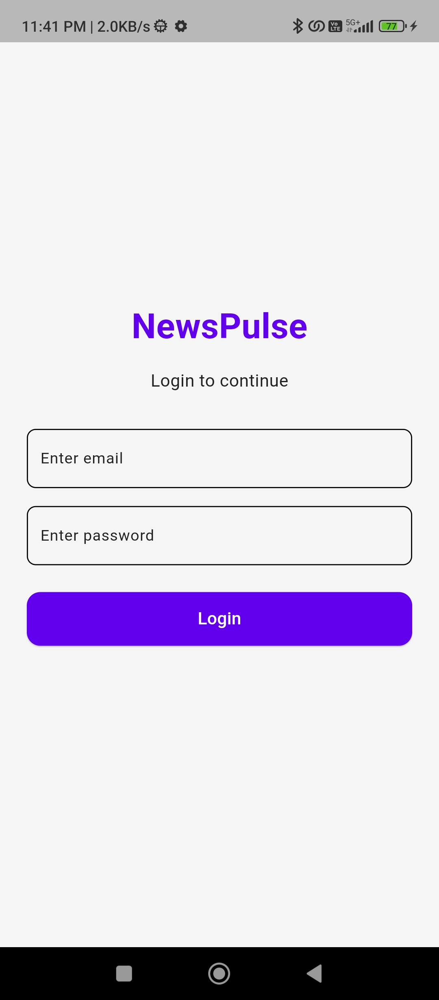</td>
    <td>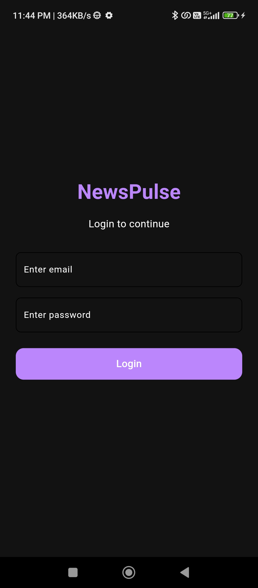</td>
  </tr>
  <tr>
    <td>Home Page</td>
    <td>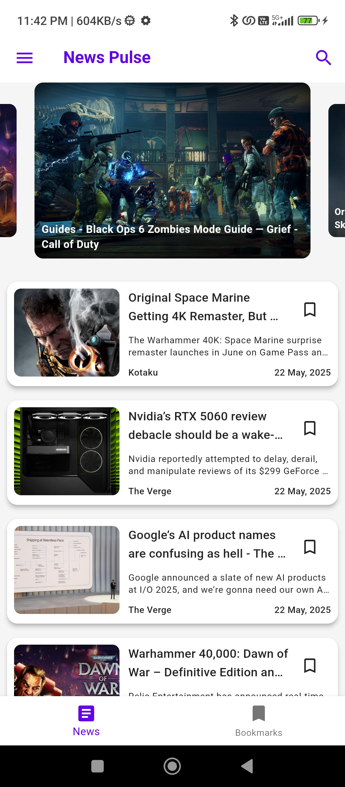</td>
    <td>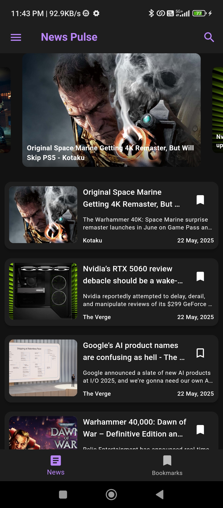</td>
  </tr>
  <tr>
    <td>Search Page</td>
    <td>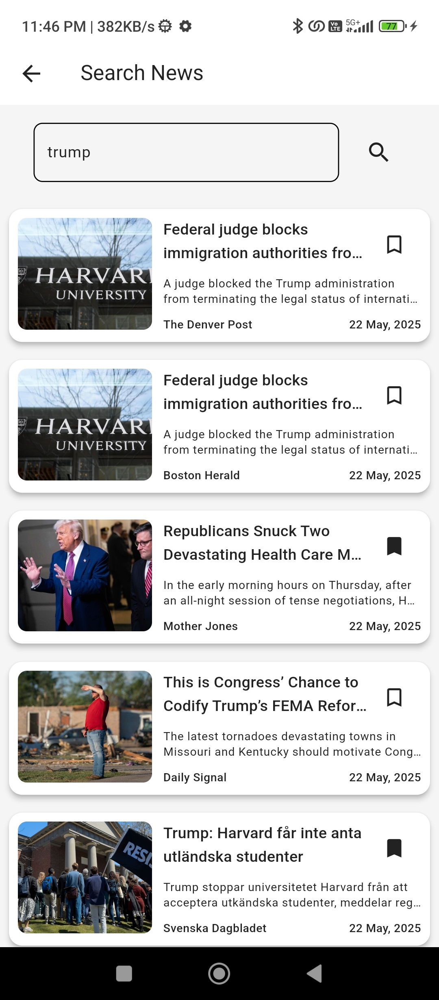</td>
    <td>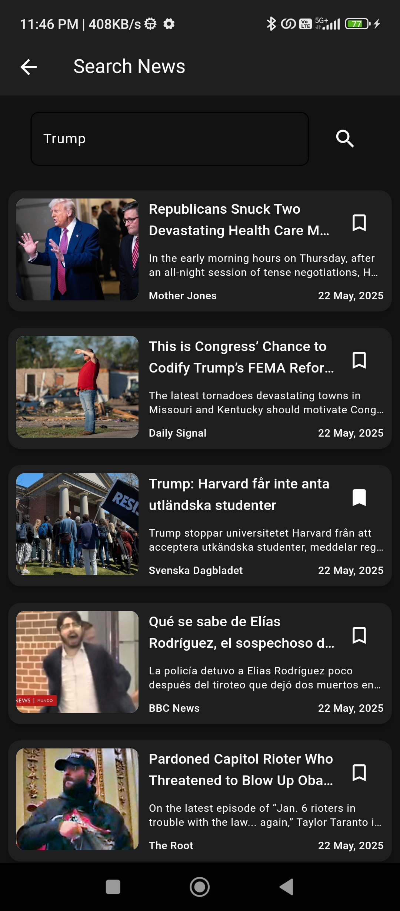</td>
  </tr>
  <tr>
    <td>Bookmark Page</td>
    <td>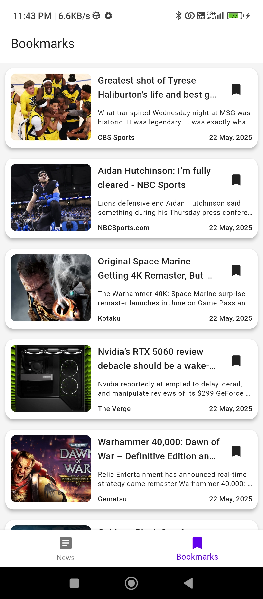</td>
    <td>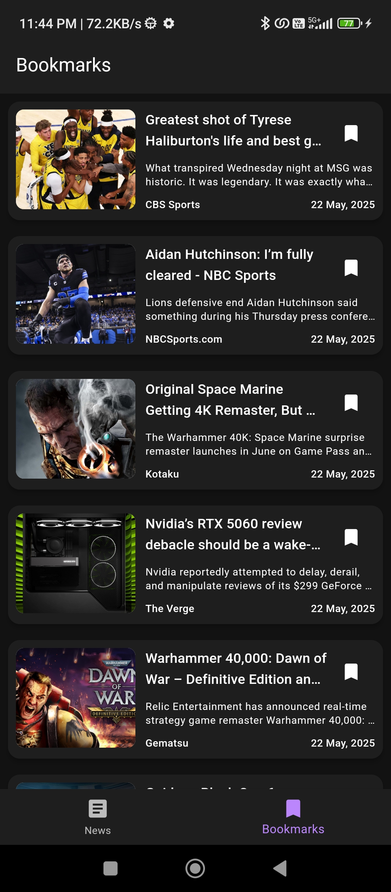</td>
  </tr>
   <!-- Single Version Screens -->
<br/>

<table>
  <tr>
    <th>WebView Article 1</th>
    <th>WebView Article 2</th>
    <th>Drawer</th>
    <th>No BookMark</th>
  </tr>
  <tr>
    <td>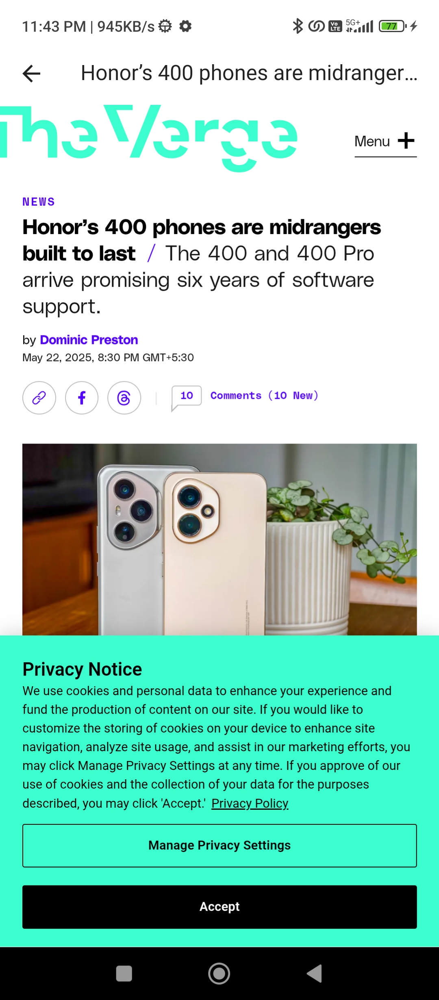</td>
    <td></td>
    <td>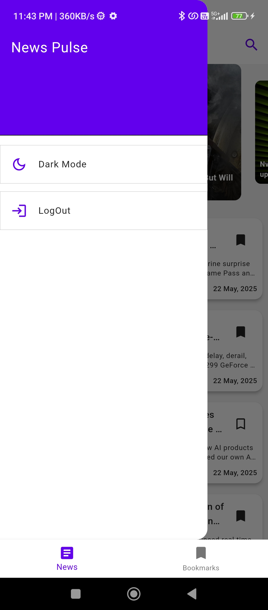</td>
    <td>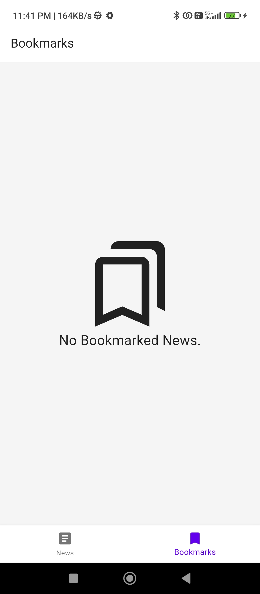</td>

  </tr>
</table>

## Architecture Choices

- The app uses a modular folder structure. Features like news, auth, and bookmarks are separated into their own folders under `lib/src/features`.
- Each feature contains subfolders like `controller`, `repo`, and `views` to separate logic layers.
- Riverpod is used for scalable and clean state management.
- Repositories handle API interactions, controllers manage business logic, and views handle UI.

This structure ensures the app is maintainable, testable, and easy to scale.

## Packages Used

| Package Name              | Reason for Use                                   |
|---------------------------|--------------------------------------------------|
| flutter_riverpod          | State management                                 |
| http                      | To make HTTP requests to NewsAPI                 |
| webview_flutter           | To open full articles within the app             |
| webview_flutter_android   | Android WebView support                          |
| carousel_slider           | For image/news sliders (top headlines, etc.)     |
| shared_preferences        | Local storage for bookmarks                      |
| intl                      | Date formatting                                  |
| shimmer                   | Placeholder loading effect for better UX         |

📬 Contact
For any queries or suggestions, please reach out to [jangramohit1891@gmail.com] or open an issue on GitHub.
   
